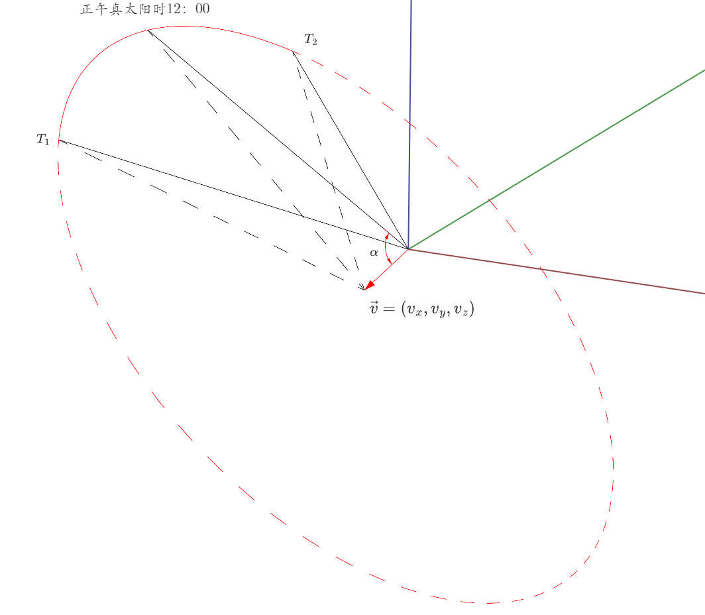

# Sunlight-shading-interval-algorithm
Sunlight shading interval algorithm based on cone and line segment intersection calculation

## 算法原理

出于简化计算的目的，本研究在单点分析时建立了如下坐标系：以分析点为原点，已$\vec v$为极轴的球极坐标系$(\gamma,\phi, \theta)$，在此坐标系下，日照弧面方程为

$
 \theta =\pi/2- \alpha
$

经由上述步骤，网格模型一个三角面片和日照锥面的遮挡区间问题转换为了理论天球上一球面三角面域和为定值一小圆的相交*φ*值区间。
